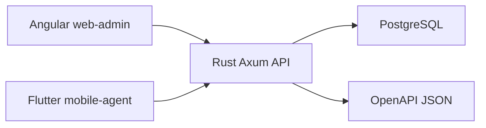

# Architecture Phase 0

## Vue logique

## Backend

- Rust Axum expose les endpoints de sante.
- SQLx cree un pool PostgreSQL lazy; `/health/db` teste vraiment la base.
- CORS est configure par `CORS_ALLOWED_ORIGINS`.
- Les erreurs de base ne sont pas exposees au client public.

## Web

- Angular sert un shell administratif sobre.
- La configuration API vient de `public/env.js`, pas directement de `.env`.
- Le shell appelle `/health` et `/health/db`.

## Mobile

- Flutter est online-first.
- `API_URL` et `APP_ENV` passent par `--dart-define`.
- Le HTTP local clair est autorise uniquement pour la validation Phase 0.

## Limites explicites

- Pas d'authentification.
- Pas de RBAC.
- Pas de migrations metier.
- Pas de generation PV, QR ou PDF.
- Pas de paiement mobile.
- Pas d'offline complet.

